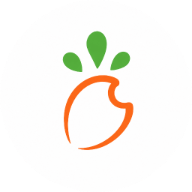

<p align="center">
    
</p>

# WheelCanvasJS

English · [简体中文](./README.md)

WheelCanvasJS is a zero-runtime-dependency JavaScript library for building configurable Canvas prize wheels. It provides independent selection and visual weights, center and external pointers, drag physics, UMD/CommonJS/ESM entry points, TypeScript declarations, responsive rendering, and keyboard support.

> Source repository: [`notluobo/wheel-canvas-js`](https://github.com/notluobo/wheel-canvas-js). Before the first npm release, enable private vulnerability reporting, configure a private conduct-reporting contact, and confirm the package name.

## Live workbench and tutorial

Open the [WheelCanvasJS live demo](https://notluobo.github.io/wheel-canvas-js/) to use the static configuration workbench, or open [`index.html`](./index.html) locally. Use the language control in the header to switch between English and Simplified Chinese. Its tutorial covers UMD and ESM setup, prizes and images, independent weights, pointer composition, drag physics, server-controlled outcomes, performance budgets, production checks, and troubleshooting.

- Full configuration reference: [`docs/config.md`](./docs/config.md)
- Capability matrix: [`docs/CAPABILITIES.md`](./docs/CAPABILITIES.md)
- Simplified Chinese configuration reference: [`docs/zh-CN/config.md`](./docs/zh-CN/config.md)
- Simplified Chinese capability matrix: [`docs/zh-CN/CAPABILITIES.md`](./docs/zh-CN/CAPABILITIES.md)

The workbench uses plain HTML, CSS, and JavaScript. It does not add a framework or runtime dependency to the core library.

The workbench automatically saves its serializable wheel configuration in the current browser and restores it on the next visit. Use **Reset configuration** beside the live preview title to clear the saved state and restore the official defaults. Functions and third-party adapter implementations are intentionally excluded from browser storage.

## Repository layout

```text
wheel-canvas-js/
├── .github/                    # Community policy, templates, and CI
├── assets/                     # Brand assets
├── demo/                       # Workbench behavior, styles, locale data, and samples
├── dist/                       # UMD, ESM, and TypeScript package entries
├── docs/                       # English references and the zh-CN documentation set
├── tests/                      # Module, type, compatibility, edge, and performance tests
├── index.html                  # Localized workbench and tutorial
└── package.json                # Package exports and release scripts
```

`node_modules/` is generated locally by `npm ci`. It is neither committed nor packed.

## Public names

- Product: `WheelCanvasJS`
- npm package: `wheel-canvas-js`
- UMD browser global: `WheelCanvasJS`
- Core class: `WheelCanvas`
- Factory: `createWheelCanvas`
- UMD file: `wheel-canvas-js.umd.js`
- ESM file: `wheel-canvas-js.esm.mjs`

The first public release exposes only these names. Retired project names are intentionally not shipped as aliases.

## Use directly in HTML

Place `wheel-canvas-js.umd.js` next to your page:

```html
<div id="wheel"></div>

<script src="./wheel-canvas-js.umd.js"></script>
<script>
    const wheel = new WheelCanvasJS.WheelCanvas('#wheel', {
        width: '320px',
        height: '320px',
        prizes: [
            {
                range: 1,
                displayWeight: 1,
                background: '#fff4df',
                fonts: [{ text: 'First prize', top: '18%' }],
            },
            {
                range: 3,
                displayWeight: 2,
                background: '#ffd8a8',
                fonts: [{ text: 'Second prize', top: '18%' }],
            },
            {
                range: 6,
                displayWeight: 3,
                background: '#fff4df',
                fonts: [{ text: 'Try again', top: '18%' }],
            },
        ],
        buttons: [
            {
                radius: '32%',
                pointer: true,
                background: '#e8590c',
                fonts: [{ text: 'SPIN', fontColor: '#fff' }],
            },
        ],
        defaultConfig: {
            useGraphicWeight: true,
            graphicWeightSource: 'displayWeight',
        },
        async start() {
            wheel.play()
            const prizeIndex = await requestPrizeFromServer()
            wheel.stop(prizeIndex)
        },
        end(prize) {
            console.log('Result:', prize)
        },
        error(error) {
            console.error('Draw failed:', error)
        },
    })
</script>
```

The complete runnable example is [`index.html`](./index.html). Configuration behavior lives in [`demo/app.js`](./demo/app.js). Double-clicking the HTML file works for local resources; use a static server when testing cross-origin images or API requests.

After the package is published, pin a CDN version instead of using `latest`:

```html
<script src="https://cdn.jsdelivr.net/npm/wheel-canvas-js@1.0.0/dist/wheel-canvas-js.umd.js"></script>
```

## npm and module usage

CommonJS:

```js
const { WheelCanvas } = require('wheel-canvas-js')
```

ESM:

```js
import WheelCanvasJS, { WheelCanvas, createWheelCanvas } from 'wheel-canvas-js'
```

`dist/wheel-canvas-js.umd.js` is the readable, maintained implementation rather than a minified generated artifact. `dist/wheel-canvas-js.esm.mjs` provides the same API as a native ESM entry.

## Selection weight and visual weight

`range` controls the client-side weighted selection performed by `stop()` without an index. `displayWeight` controls the visible sector size. They are independent:

```js
defaultConfig: {
    useGraphicWeight: true,
    graphicWeightSource: 'displayWeight',
}
```

`graphicWeightSource` accepts:

- `displayWeight`: read only `displayWeight`; invalid or missing values become `1`.
- `range`: use `range` to size sectors.
- `auto`: prefer `displayWeight` and fall back to `range`.

When `useGraphicWeight` is disabled, all sectors are equal. For prizes with monetary value, inventory, or rights attached, obtain the result from a trusted server and call `wheel.stop(index)`. Browser-side weights and `Math.random()` are not anti-cheat mechanisms.

## Pointer system

Without a top-level `pointer`, existing `buttons[].pointer: true` behavior is preserved. A pointer may be centered, external, hidden, positioned on any side, or placed at an arbitrary clockwise angle.

```js
pointer: {
    type: 'external',
    position: 'top',
    preset: 'minimal',
    color: '#7c3aed',
    colorSource: 'currentPrize',
    cornerRadius: 3,
    borderColor: '#ffffff',
    borderWidth: 2,
    width: '6%',
    height: '5%',
    layout: 'stable',
    space: 18,
    tipInset: 14,
    mount: false,
    wobble: {
        enabled: true,
        amplitude: 2.5,
        duration: 180,
        frequency: 14,
        damping: 12,
        respectReducedMotion: true,
    },
}
```

The 21 built-in presets are `minimal`, `classic`, `flapper`, `wedge`, `needle`, `pin`, `glass`, `jewel`, `triangle`, `kite`, `arrow`, `chevron`, `diamond`, `notch`, `teardrop`, `spear`, `soft`, `tab`, `dart`, `shield`, and `ribbon`.

Center and external pointers share shape, color, size, outline, corner radius, and angle options. `colorSource: 'currentPrize'` follows the sector under the pointer. `wobble` adds a damped visual response when sector boundaries are crossed. Neither option changes selection geometry or the final result. Shadows are disabled by default.

External pointer layout strategies:

- `stable`: reserves fixed space so pointer adjustments do not resize the wheel.
- `fit`: fits the wheel against the pointer's measured bounds.
- `overlay`: reserves no space and draws over the maximum wheel area.

Centered pointers support `fused`, `fusionStyle`, `radialOffset`, and independent sizing through `referenceSize`. `fusionStyle: 'adaptive'` preserves the selected preset while producing one continuous center outline; `droplet` uses a fixed drop silhouette; `layered` keeps the button and pointer visually separate.

## Images and typography

Prizes, center buttons, and blocks support layered images. Supplying only `width` or `height` preserves the source aspect ratio.

```js
prizes: [
    {
        name: 'Travel voucher',
        fonts: [{ text: 'Travel voucher', top: '18%' }],
        imgs: [
            {
                src: './gift.png',
                visible: true,
                width: '34%',
                top: '42%',
                crossOrigin: 'anonymous',
            },
        ],
    },
]
```

Center logos use `buttons[].imgs`. Cross-origin servers must allow CORS. Keep a textual `name` or font entry for result announcements and accessibility, even when a prize is displayed as an image only.

`FontConfig` supports horizontal and vertical text, explicit and automatic wrapping, `lengthLimit`, `lineClamp`, `ellipsis` or `clip`, custom ellipsis markers, alignment, and per-prize overrides. Percentage `fontSize` and `lineHeight` values scale from the shorter canvas edge; numbers, `px`, `rem`, `vw`, and `vh` keep their normal unit semantics.

Use `defaultStyle.top`, `defaultStyle.left`, and `defaultStyle.textAlign` for global prize text placement, or override them in `prizes[].fonts[]`. `top` moves along the radius and `left` moves along the sector tangent.

Use `wheel.setSize(width, height)` to change both dimensions with one reflow. The workbench treats 280–1200px as the design-size range while reporting the actual responsive preview size and DPR separately.

## Drag and physical rotation

Physics is opt-in at library level and enabled in the workbench by default. It supports mouse, pen, and touch dragging:

```js
physics: {
    enabled: true,
    sensitivity: 1,
    innerRadius: '8%',
    minVelocity: 36,
    maxVelocity: 1800,
    friction: 24,
    drag: 0.68,
    stopVelocity: 3,
    waitingVelocity: 72,
    waitingStrategy: 'hold',
    sampleWindow: 110,
    releaseDamping: 7,
    maxSubstep: 10,
    maxCatchUp: 220,
    accelerationBlendDuration: 120,
    errorStrategy: 'coast',
    resultTimeout: 10000,
    dragFrom: 'prizes',
    direction: 'both',
    resultMode: 'natural',
}
```

Velocity is measured in degrees per second. Release speed is estimated from a recent weighted sample window, and mixed friction is integrated in bounded substeps for refresh-rate independence. A controlled result plans a continuous braking trajectory from the current position, velocity, and acceleration without secretly accelerating to meet a fixed duration.

`resultMode: 'natural'` settles by physical position. `weighted` selects from `range` on release. `onRelease` may return an index or `Promise<number>` for a server-controlled landing. Invalid, rejected, timed-out, or physically impossible results enter `error`; with the default `errorStrategy: 'coast'`, they settle naturally and do not emit a winning `end` event.

You may also call `wheel.spin(900)` or `wheel.spin(-900)` to begin inertial rotation at a signed velocity.

## Sound and celebration adapters

The core contains no audio assets and does not depend on a confetti library. Optional `feedback` adapters receive semantic sector and completion cues. Adapter errors are isolated from selection and animation.

```js
feedback: {
    enabled: true,
    sound: {
        enabled: true,
        sectorCue: 'snap',
        resultCue: 'reward',
        volume: 0.3,
        minInterval: 35,
        play(cue, detail, soundConfig) {
            uiSfx.play(cue, { volume: soundConfig.volume })
        },
    },
    celebration: {
        enabled: true,
        style: 'subtle',
        particleCount: 48,
        disableForReducedMotion: true,
        fire(style, detail, celebrationConfig) {
            confetti({
                particleCount: celebrationConfig.particleCount,
                colors: detail.colors,
                disableForReducedMotion: celebrationConfig.disableForReducedMotion,
            })
        },
    },
}
```

Audio normally needs to be unlocked by a user gesture. Respect reduced-motion preferences and rate-limit tick sounds. For high-value draws, feedback remains decorative; the result still belongs to trusted business logic.

## Public methods

Wait for `await wheel.ready` before reading pixels or relying on loaded images.

- `play()`: start scripted rotation.
- `spin(velocity)`: start physical inertia at degrees per second; negative is counterclockwise.
- `stop(index)`: stop on a specific prize.
- `stop()`: select on the client using `range`.
- `cancel(reason)`: cancel without producing a winning result.
- `init()`: reset, load assets, and draw.
- `update(config)`: merge configuration and reinitialize.
- `setSize(width, height)`: update both logical dimensions in one resize.
- `resize()`: recompute responsive size and DPR.
- `getCurrentPrizeIndex()`: read the prize under the pointer.
- `isRunning()`: report whether an animation or physical session is active.
- `clearCanvas()`: clear the canvas.
- `destroy()`: cancel work, remove listeners and observers, and restore the host DOM.

See [`docs/config.md`](./docs/config.md) and [`dist/wheel-canvas-js.d.ts`](./dist/wheel-canvas-js.d.ts) for the complete API contract.

## Runtime update rules

Colors, text, and image settings may be edited reactively. Once a spin begins, prize order, angle layout, complete pointer visuals, and physics parameters are frozen for that session.

Adding, replacing, removing, or reordering `prizes` during a spin cancels the session, emits `error`, and does not emit `end`. Visual weight, offset, and pointer changes take effect after the active session. Configuration tools should disable structural controls while the wheel is running.

## Browser requirements

- Canvas 2D.
- Pointer Events for drag physics.
- `Promise` and `Promise.prototype.finally`.
- `Proxy` for deep reactive configuration.
- `Map`, `WeakMap`, `Set`, and `requestAnimationFrame`; animation frames have a timer fallback.

`ResizeObserver` and `MutationObserver` are progressive enhancements. Without them, window resize handling and manual `wheel.resize()` remain available.

## Development and verification

```powershell
npm ci
npm test
npm run pack:check
```

Tests cover CommonJS, ESM, browser globals, strict TypeScript declarations, compatibility behavior, animation landing, weighted geometry, image caching, callback rollback, resource cleanup, layout and text caches, canvas budgets, localization entry points, and performance regression thresholds.

Real Canvas visual regression should still be performed in Chromium, Firefox, and WebKit before a major release. Canvas mocks are not pixel-level screenshot tests.

## Contributing, security, and releases

- Contributing: [`.github/CONTRIBUTING.md`](./.github/CONTRIBUTING.md) · [`简体中文`](./docs/zh-CN/CONTRIBUTING.md)
- Coding style: [`docs/CODING_STYLE.md`](./docs/CODING_STYLE.md) · [`简体中文`](./docs/zh-CN/CODING_STYLE.md)
- Security: [`.github/SECURITY.md`](./.github/SECURITY.md) · [`简体中文`](./docs/zh-CN/SECURITY.md)
- Code of conduct: [`.github/CODE_OF_CONDUCT.md`](./.github/CODE_OF_CONDUCT.md) · [`简体中文`](./docs/zh-CN/CODE_OF_CONDUCT.md)
- Release checklist: [`docs/RELEASE.md`](./docs/RELEASE.md) · [`简体中文`](./docs/zh-CN/RELEASE.md)
- Changelog: [`CHANGELOG.md`](./CHANGELOG.md) · [`简体中文`](./docs/zh-CN/CHANGELOG.md)
- Localization policy: [`docs/LOCALIZATION.md`](./docs/LOCALIZATION.md) · [`简体中文`](./docs/zh-CN/LOCALIZATION.md)

## License and attribution

WheelCanvasJS is licensed under the Apache License 2.0. See [`LICENSE`](./LICENSE). Required source, copyright, and modification notices are centralized in [`NOTICE`](./NOTICE); they are not product names, package names, or public API aliases.
